# 🚢 Shipping Load Verifier — Architecture & Design in Diagrams

Diagram-first reference for how the system works and the OOP / design patterns behind it. Every diagram below is GitHub-flavored Mermaid — copy the fenced block as-is.

**Shape legend**

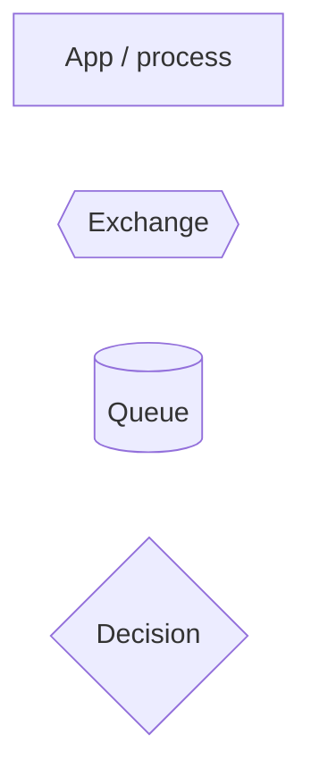
 
---

## 1. End-to-end message flow

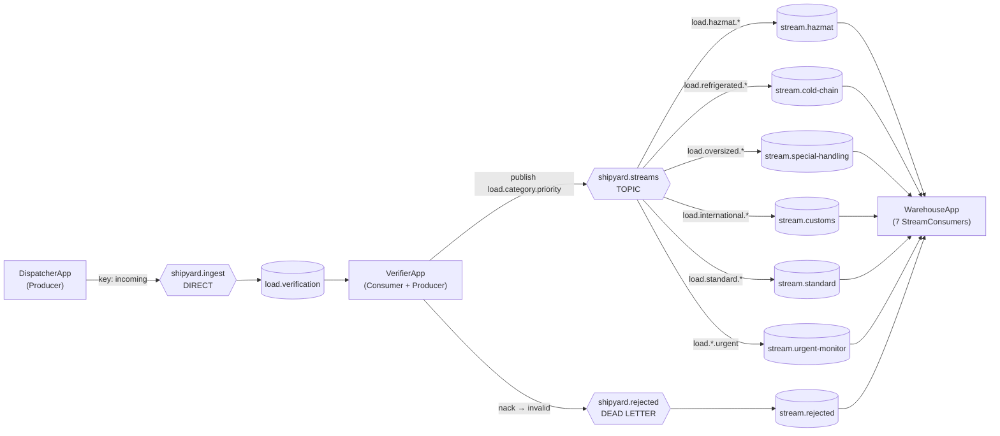
 
---

## 2. Topic exchange — one message, multiple queues

An urgent hazmat load matches two bindings at once.

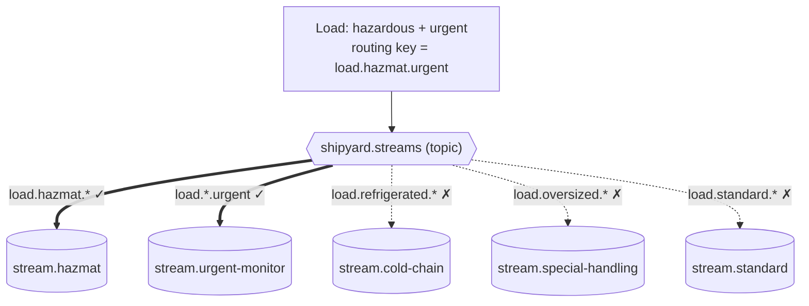
 
---

## 3. Message lifecycle (valid vs invalid)

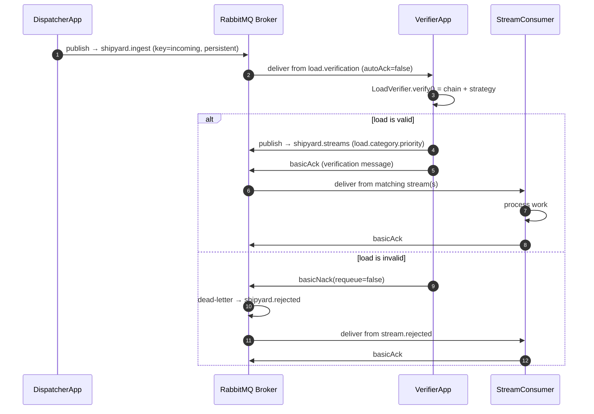
 
---

## 4. Delivery acknowledgement states

Why manual ack matters: a crash before ack means redelivery, not data loss.

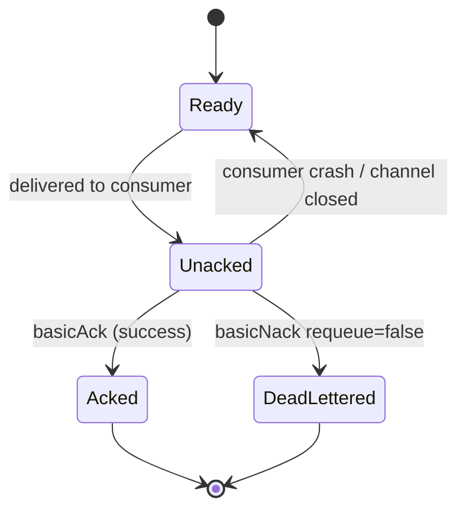
 
---

## 5. Chain of Responsibility — verification pipeline

### 5a. Runtime flow (short-circuits on first failure)

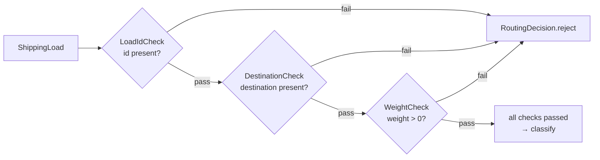

### 5b. Class structure

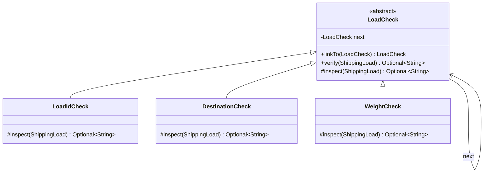
 
---

## 6. Strategy — swappable classification

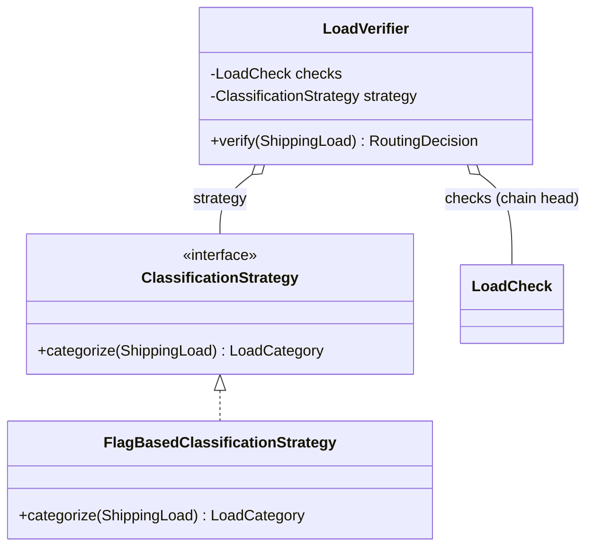
 
---

## 7. Proxy — reliable publisher

### 7a. Class structure

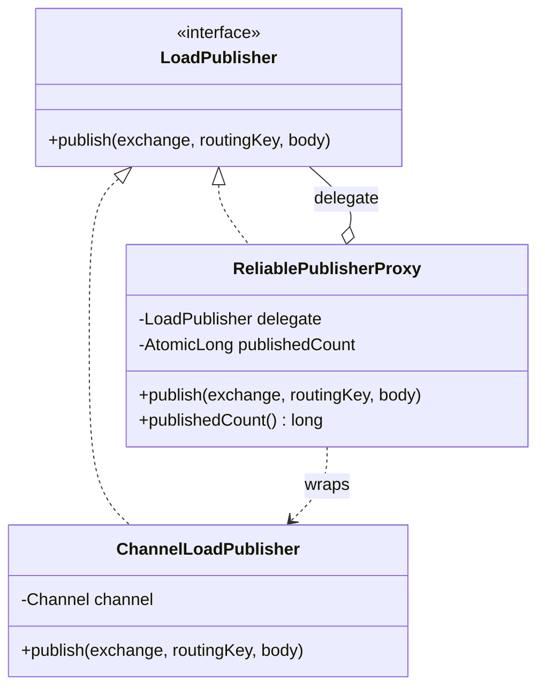

### 7b. Call flow through the proxy

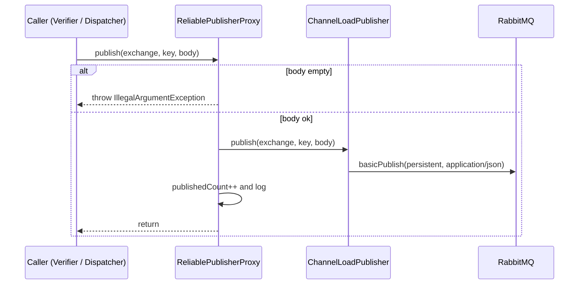
 
---

## 8. OOP / package map

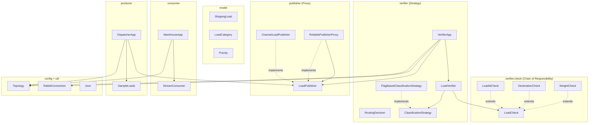
 
---

## 9. Runtime & deployment

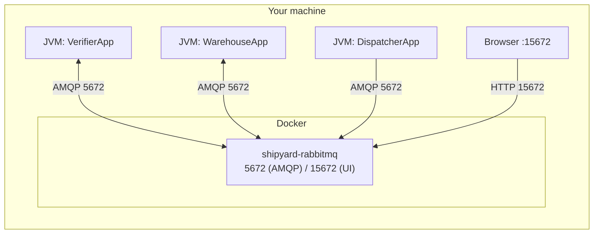
 
---

## 10. Prefetch / fair dispatch (QoS)

Run more than one verifier; `basicQos(1)` spreads work evenly.

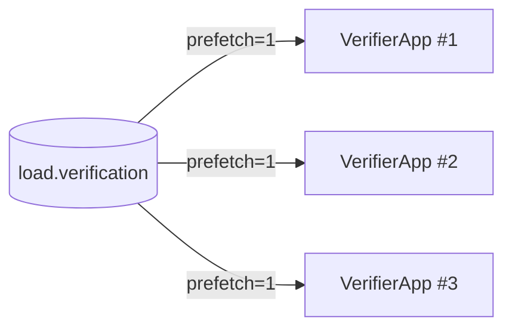
 
---

## 11. Object collaboration inside `VerifierApp`

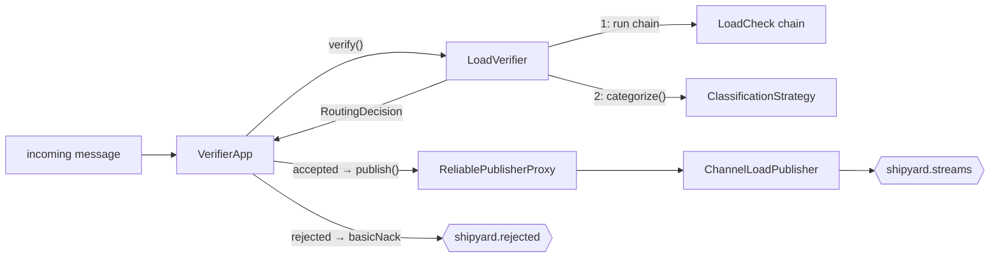