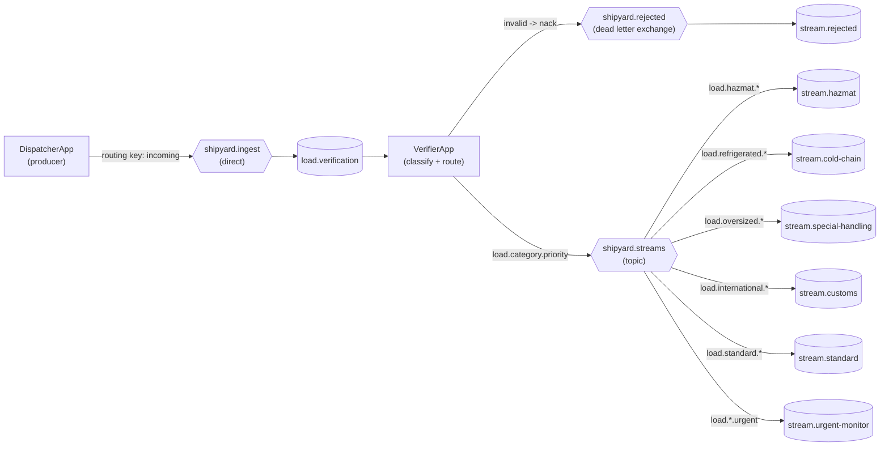

# Shipping Load Verifier - Learn RabbitMQ by Routing Freight

A small, runnable Java project that teaches the core concepts of RabbitMQ through a believable example: a shipping yard where every incoming load is verified and then routed to the correct processing stream based on its nature - hazardous, refrigerated, oversized, international, or standard.
It is deliberately built on the plain RabbitMQ Java client (no Spring magic) so every concept exchanges, queues, bindings, routing keys, acknowledgements, dead-lettering is visible and explicit in the code.
A note on the word "stream": here it means a *logical processing Lane* (a queue and its consumer). RabbitMQ also has a separate built-in feature literally called Streams (an append-only, log-style queue type). This project does **not** use that feature, but only classic queues.

---

## What you'll learn

| Concept | Where it lives in the code |
| --- | --- |
| **Connections vs Channels** | `config/RabbitConnection.java` - one connection per app, one channel per consumer thread |
| **Direct exchange** | `shipyard.ingest` - producers drop raw loads here |
| **Topic exchange wildcards** | `shipyard.streams` - routes on keys like `load.hazmat.urgent` |
| **Queues & Bindings** | `config/Topology.java` - each stream binds a pattern |
| **Routing keys** | `verifier/RoutingDecision.java` - builds `load.<category>.<priority>` |
| **Producer** | `producer/DispatcherApp.java` |
| **Consumer** | `producer/DispatcherApp.java` |
| **Manual acknowledgement (ack)** | `VerifierApp` & `StreamConsumer` - ack only after work succeeds |
| **Negative ack (nack) + Dead Letter Exchange** | `VerifierApp` - bad loads are dead-lettered to `stream.rejected` |
| **Prefetch/QoS (fair dispatch)** | `basicQos(1)` in the verifier and every consumer |
| **Durable topology & persistent messages** | `deliveryMode(2)` + durable queues - survive a broker restart |
| **Topic fan-out to multiple queues** | `load.*.urgent` - one urgent load reaches its category stream **and** the urgent monitor |

---

## Architecture



**The pipeline in words:**
1. The **Dispatcher** (producer) drops raw loads onto the `shipyard.ingest` direct exchange. It has *no idea* which stream they'll end up in - that decoupling is the whole point of a broker.
2. The **Verifier** consumes each load, validates it, and figures out its nature.
    - **Invalid?** It's `nack-ed` (no requeue), so RabbitMQ automatically **dead-letters** it to `stream.rejected`.
    - **Valid?** The verifier publishes it to the `shipyard.streams` topic exchange with a key like `load.hazmat.urgent`.
3. **Topic bindings** route each load to the matching stream(s). An **urgent** load matches *both* its category queue and the cross-cutting `stream-urgent-monitor`.

Also see [ARCHITECTURE.md](ARCHITECTURE.md) for diagrams

---

## Prerequisites
- Java 17+
- Maven 3.8+
- Docker (easiest way to run RabbitMQ) - or a local RabbitMQ install

---

## Running it

### 1. Start RabbitMQ
```bash
docker compose up -d
```
This launches RabbitMQ with the management UI at **http://localhost:15672** (login: `guest` / `guest`).

### 2. Build
```bash
mvn clean compile
```

### 3. Open three terminals
**Terminal A - start the verifier (the router):**
```bash
mvn exec:java -Dexec.mainClass="com.shipyard.verifier.VerifierApp"
```

**Terminal B - start all the processing streams:**
```bash
mvn exec:java -Dexec.mainClass="com.shipyard.consumer.WarehouseApp"
```

**Terminal C - dispatch a batch of loads:**
```bash
mvn exec:java -Dexec.mainClass="com.shipyard.producer.DispatcherApp"
```

Watch Terminal A classify each load and Terminal B receive them on the right streams. The two deliberately broken loads (`LD-1007` with no destination, `LD-1008` with zero weight) will appear on the `REJECTED` stream via the dead letter exchange.

> Optional: run `com.shipyard.setup.SetupTopologyApp` first if you just want to create the exchanges/queues and inspect them in the management UI before sending anything.

---

## What to look for
- **`LD-1001`** (hazardous + urgent) arrives on **both** `HAZMAT` and `URGENT-MON` - proof that one message can satisfy multiple topic bindings.
- **`LD-1003`** (18,500 kg) is routed as `OVERSIZED` purely from its weight.
- **`LD-1007` / ` LD-1008`** never reach a stream - they're rejected and dead-lettered.
- Stop the warehouse consumers, dispatch more loads, then restart: the messages are **still there** because queues are durable and messages are persistent.

---

## Try these extensions
1. **Multi-stream loads.** Right now a load gets exactly one category. Model a load that is *both* hazmat *and* refrigerated and route it to both streams (hint: publish with multiple keys, or use a header exchange).
2. **Scale a consumer.** Start two `VerifierApp` instances and watch `basicQos(1)` distribute work fairly between them.
3. **Retry with TTL.** Add a delay queue (message TTL + DLX) so rejected loads are retried after 30 seconds instead of sitting in `stream.rejected`.
4. **Publisher confirms.** Enable `channel.confirmSelect()` in the dispatcher so the producer knows the broker safely received each load.
5. **Swap the topic exchange for a headers exchange** and route on message headers instead of routing keys.

---

## Project layout
```
shipping-load-verifier/
├── docker-compose.yml  # one-command RabbitMQ
├── pom.xml
└── src/main/java/com/shipyard/
      ├── config/
      │   ├── RabbitConnection.java  # opens the broker connection
      │   └── Topology.java          # ALL exchanges, queues, bindings (start here)
      ├── model/
      │   ├── ShippingLoad.java  # the message payload
      │   ├── LoadCategory.java
      │   └── Priority.java
      ├── producer/
      │   ├── DispatcherApp.java  # publishes loads to the ingest exchange
      │   └── SampleLoads.java  # demo data, incl. invalid loads
      ├── verifier/
      │   ├── LoadClassifier.java  # pure business rules (easy to unit test)
      │   ├── RoutingDecision.java
      │   └── VerifierApp.java  # consumer + producer; ack/nack/DLX
      ├── consumer/
      │   ├── StreamConsumer.java  # reusable per-stream consumer
      │   └── WarehouseApp-java  # boots every stream at once
      └── setup/
          └── SetupTopologyApp.java  # optional: declare topology and exit
```

`config/Topology.java` is the best place to start reading - it is the single source of truth for how everything is wired.

---

## License
MIT - use it, fork it, learn from it.
